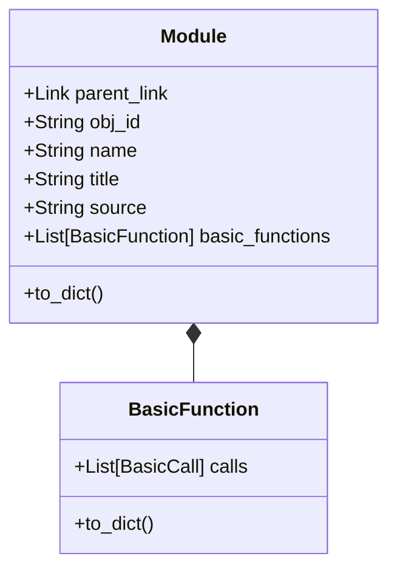
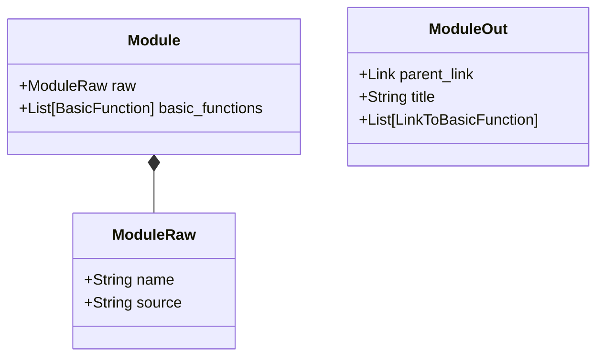

# Design plan
## Introduction
The current design uses one family of datastructures to represent the StarOffice components:
1. Basic library
2. Basic module
3. Basic function
4. Python library
5. Python module
6. Python function
7. Table
8. Column
9. Key
10. Index
11. View
12. QueryColumn
13. Query
14. Form
15. SubForm
16. Control
17. ListBox
18. Grid
19. Report
20. Text document

The classes representing the components above are complex because they mix data used for the dependency search and for representation. 

For example the Module class:

For Module obj_id, title and to_dict have to do with the representation. basic_functions stores the analysis result.

## New design setup 

In principle for all components mentioned above we make three classes. For example for Module we create ModuleRaw for the result of the reading process. Then a Module for the dependency search and the representation layer can make a ModuleOut to collect the attributes it needs for the representation.

The preprocess_module and represent_module function should have this type
```python
def preprocess_module(module: ModuleRaw) -> Module:
    ...

def represent_module(module: Module) -> ModuleOut
    ...
```
These classes can be frozen. The class instances are not modified in their lifetime.

Downside of this approach is that it potentially leads to 60 classes.

### Inventarisation 
#### Table
Table = TableRaw, but TableOut needed
#### View
ViewRaw, View and ViewOut needed
#### Query
See View
#### BasicLibrary
Gives BasicLibraryRaw and BasicLibrary and BasicLibraryOut
#### BasicModule
BasicModuleRaw, BasicModule, BasicFunction, BasicCall, BasicToken
#### PythonLibrary
PythonLibrary 
#### PythonModule
PythonModule
#### Form
FormRaw, Form
