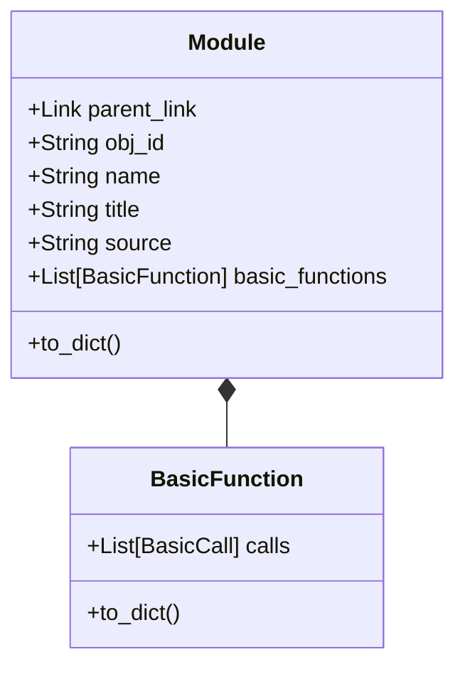
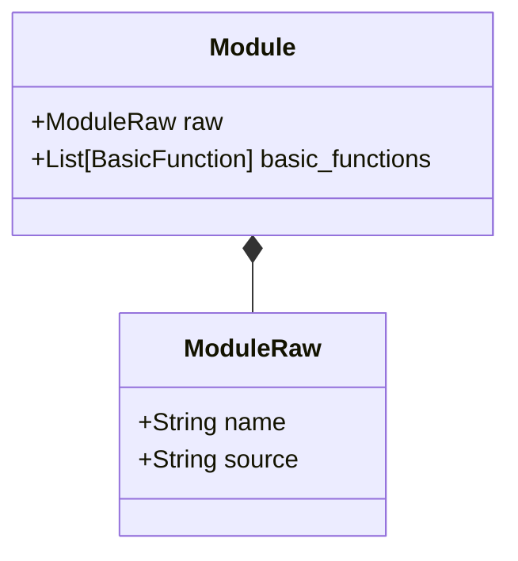
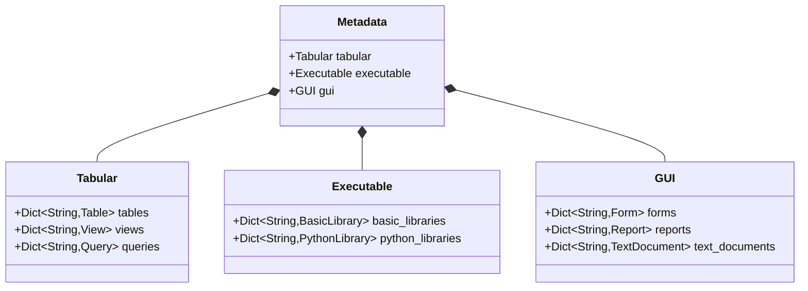

# Design plan
## Introduction
The current design uses one family of datastructures to represent the StarOffice components:
1. Basic library
2. Basic module
3. Basic function
4. Python library
5. Python module
6. Python function
7. Table
8. Column
9. Key
10. Index
11. View
12. QueryColumn
13. Query
14. Form
15. SubForm
16. Control
17. ListBox
18. Grid
19. Report
20. Text document

The classes representing the components above are complex because they mix data used for the dependency search and for representation. 

For example the Module class:

For Module obj_id, title and to_dict have to do with the representation. basic_functions stores the analysis result.

## New design setup 

In principle for all components mentioned above we make three classes. For example for Module we create ModuleRaw for the result of the reading process. Then a Module for the dependency search.


The preprocess_module function has this type
```python
def preprocess_module(module: ModuleRaw) -> Module:
    ...

```
These classes can be frozen. The class instances are not modified in their lifetime.
For this the ```__post_init__``` methods have to go, have to use factories instead.

### Inventarisation 
### Unproblematic, only one class needed
PythonLibrary, PythonModule, Table, TextDocument and Report.
### Raw class needed
Form, View, EmbeddedQuery and Query.
Separate Raw classes needed (4 classes extra).
### Hard
BasicLibrary gives classes
BasicModule, BasicFunction, BasicCall, BasicToken
and needs BasicLibraryRaw and BasicModuleRaw.
(2 classes extra)

So 6 more classes needed.

More work needed for the representation layer, which is based on the 'normal' classes, e.g. Table, Module etc.

New metadata class:

